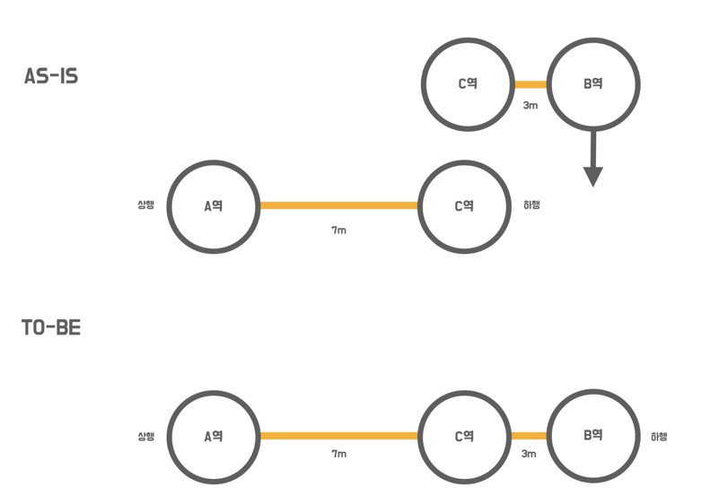

# 🚀 3단계 - 지하철 구간 관리
## 요구사항

### 기능 요구사항
- 요구사항 설명에서 제공되는 요구사항을 기반으로 지하철 구간 관리 기능을 구현하세요.
- 요구사항을 정의한 인수 조건을 도출하세요.
- 인수 조건을 검증하는 인수 테스트를 작성하세요.
- 예외 케이스에 대한 검증도 포함하세요.

### 프로그래밍 요구사항
- 인수 테스트 주도 개발 프로세스에 맞춰서 기능을 구현하세요.
- 요구사항 설명을 참고하여 인수 조건을 정의
- 인수 조건을 검증하는 인수 테스트 작성
- 인수 테스트를 충족하는 기능 구현
- 인수 조건은 인수 테스트 메서드 상단에 주석으로 작성하세요.
- 뼈대 코드의 인수 테스트를 참고
- 인수 테스트의 결과가 다른 인수 테스트에 영향을 끼치지 않도록 인수 테스트를 서로 격리 시키세요.
- 인수 테스트의 재사용성과 가독성, 그리고 빠른 테스트 의도 파악을 위해 인수 테스트를 리팩터링 하세요.

### 구간 등록 기능
- 지하철 노선에 구간을 등록하는 기능을 구현
- 새로운 구간의 상행역은 해당 노선에 등록되어있는 하행 종점역이어야 한다.
- 새로운 구간의 하행역은 해당 노선에 등록되어있는 역일 수 없다.
- 새로운 구간 등록시 위 조건에 부합하지 않는 경우 에러 처리한다.

```text
POST /lines/1/sections HTTP/1.1
accept: */*
content-type: application/json; charset=UTF-8
host: localhost:52165

{
    "downStationId": "4",
    "upStationId": "2",
    "distance": 10
}
```



### 구간 제거 기능
- 지하철 노선에 구간을 제거하는 기능 구현
- 지하철 노선에 등록된 역(하행 종점역)만 제거할 수 있다. 즉, 마지막 구간만 제거할 수 있다.
- 지하철 노선에 상행 종점역과 하행 종점역만 있는 경우(구간이 1개인 경우) 역을 삭제할 수 없다.
- 새로운 구간 제거시 위 조건에 부합하지 않는 경우 에러 처리한다.

### 구간 삭제 기능
```text
DELETE /lines/1/sections?stationId=2 HTTP/1.1
accept: */*
host: localhost:52165
```

### 구간 관리 기능의 예외 케이스를 고려하기
- 구간 등록과 제거 기능의 예외케이스들에 대한 시나리오를 정의
- 인수 테스트를 작성하고 이를 만족시키는 기능을 구현